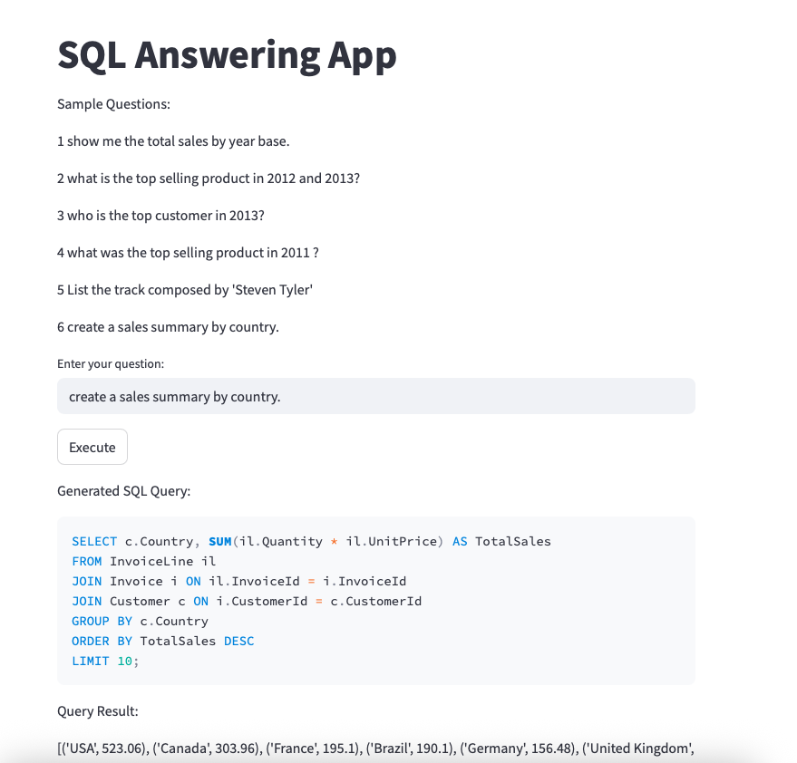

# SQL Answering App

## Overview
This application allows users to input natural language questions about a database and generates SQL queries to retrieve answers. It uses Streamlit for the user interface, LangChain for SQL query generation, and Grok (via ChatGroq) for natural language processing. The app connects to a SQLite database (`Chinook.db`) and displays both the generated SQL query and its results.

## Features
- Converts natural language questions into SQL queries.
- Executes queries on the Chinook SQLite database.
- Displays the generated SQL query and its results in a user-friendly Streamlit interface.
- Includes sample questions for easy testing.
- Handles errors gracefully with user feedback.

## Prerequisites
- Python 3.8+
- SQLite database (`Chinook.db`) in the project directory
- Required Python packages (install via `pip`):
  ```bash
  pip install streamlit langchain langchain-community langchain-groq sqlalchemy python-dotenv
  ```

## Setup
1. Clone the repository or copy the code to your local machine.
2. Ensure the `Chinook.db` SQLite database is in the project directory.
3. Create a `.env` file with your Grok API key:
   ```env
   GROQ_API_KEY=your_api_key_here
   ```
4. Place the `screenshot.png` image in the project directory or an `images/` subdirectory.
5. Install dependencies:
   ```bash
   pip install -r requirements.txt
   ```
6. Run the Streamlit app:
   ```bash
   streamlit run app.py
   ```

   

## Usage
1. Launch the app using the command above.
2. Open the provided URL in your browser (typically `http://localhost:8501`).
3. Enter a question in the text input field (e.g., "Show me the total sales by year").
4. Click the "Execute" button to generate and run the SQL query.
5. View the generated SQL query and its results in the interface.

## Sample Questions
- Show me the total sales by year base.
- What is the top selling product in 2012 and 2013?
- Who is the top customer in 2013?
- What was the top selling product in 2011?
- List the track composed by 'Steven Tyler'.
- Create a sales summary by country.

## Code Structure
- **Imports**: Libraries for Streamlit, LangChain, SQL handling, and logging.
- **Database Connection**: Connects to `Chinook.db` using `SQLDatabase`.
- **LLM Setup**: Uses `ChatGroq` with the `llama3-70b-8192` model for query generation.
- **Prompt Template**: Custom prompt for generating SQL queries.
- **Query Execution**: Converts questions to SQL and executes them, handling errors.
- **Streamlit Interface**: Displays input field, sample questions, and results.

## Error Handling
- Logs errors using Python's `logging` module.
- Displays user-friendly error messages in the Streamlit interface if a query fails.

## Notes
- Ensure the `.env` file contains a valid Grok API key.

 
